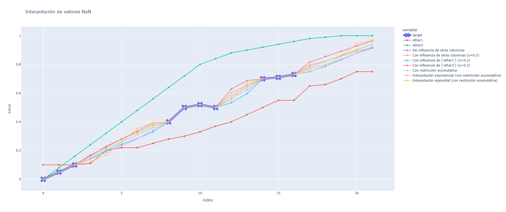

# 📌 Interpolación de Valores Faltantes con Reglas Personalizadas

## 📝 Descripción

Esta función de interpolación permite rellenar los valores faltantes (`NaN`) en una **columna objetivo** de un `DataFrame`, combinando la interpolación (ya sea **lineal**, **exponencial** o **sigmoidal**) con información proveniente de **otras columnas** según un peso configurable. Además, se aplican restricciones para que los cambios entre valores consecutivos sean suaves, se añade ruido aleatorio a cada valor interpolado y, opcionalmente, se impone una restricción acumulativa. La particularidad es que:

- **Al rellenar de izquierda a derecha** (caso habitual), se garantiza que cada nuevo valor no sea inferior al anterior (serie no decreciente).
- **Al rellenar de derecha a izquierda** (cuando el primer valor está ausente), se garantiza que cada nuevo valor no sea mayor que el valor a su derecha (serie no creciente en sentido inverso).

Las reglas principales son:

1. **Dirección del Relleno**  
   - **Normal:** Se interpola de **izquierda a derecha**.  
   - **Excepción:** Si el bloque de `NaN` inicia en el **primer valor**, se interpola de **derecha a izquierda**.

2. **Valores Límite ($min\_value$ y $max\_value$)**  
   - En el **extremo izquierdo**, se usa $min\_value$ como límite inferior.  
   - En el **extremo derecho**, se usa $max\_value$ como límite superior.

3. **Restricción de Cambio ($max\_step$)**  
   - El incremento o decremento entre valores consecutivos (tanto interpolados como ya existentes) no puede superar $max\_step$.  
   - Esto garantiza una transición suave entre los valores conocidos y los interpolados.

4. **Ruido ($noise$)**  
   - A cada valor interpolado se le añade un ruido aleatorio uniforme en el intervalo $[-noise, +noise]$.

5. **Modo de Interpolación ($fill\_mode$)**  
   - Permite seleccionar el método de interpolación:
     - **`linear`:** Interpolación lineal.
     - **`exponential`:** Interpolación exponencial.
     - **`sigmoidal`:** Interpolación sigmoidal. Se utiliza una función logística normalizada para controlar la progresión, donde la pendiente se regula con una constante $k$ (fijada a 10 en la implementación).

6. **Restricción Acumulativa ($cumm$)**  
   - Si se activa ($cumm = \text{True}$), se impone que:
     - **Al rellenar de izquierda a derecha:** Cada nuevo valor no será inferior al anterior (serie no decreciente).
     - **Al rellenar de derecha a izquierda:** Cada nuevo valor no será mayor que el valor a su derecha (serie no creciente en sentido inverso).

7. **Combinación con Otras Columnas ($other\_weight$)**  
   - Se calcula la media de las columnas adicionales (ignorando $NaN$) para cada fila en la que se interpola.  
   - El valor final se obtiene combinando el valor interpolado y la media de las otras columnas según la fórmula:

     $$
     v_{i,\text{final}} = (1 - \text{other\_weight}) \cdot v_{i,\text{interp}} + \text{other\_weight} \cdot v_{i,\text{other}}
     $$

     donde:
     - $v_{i,\text{interp}}$ es el valor obtenido por la interpolación (lineal, exponencial o sigmoidal).
     - $v_{i,\text{other}}$ es la media de los valores en las columnas adicionales para la fila $i$.

8. **Semilla Aleatoria ($seed$)**  
   - Permite fijar una semilla para el generador de números aleatorios y asegurar la reproducibilidad de los resultados.

---

## 📌 Fórmulas de Interpolación

Para un bloque de $k$ valores $NaN$, con los siguientes valores de frontera:
- $L =$ valor conocido anterior al bloque.
- $R =$ valor conocido posterior al bloque.

La interpolación se realiza de la siguiente manera:

- **Interpolación Lineal:**
  }{(k&plus;1)}\right)\cdot(R-L)$$)

- **Interpolación Exponencial:**

  -1}{e-1}\right)\cdot(R-L)$$)

- **Interpolación Sigmoidal:**

  Sea 
  $$
  \text{frac} = \frac{i - \text{start} + 1}{k + 1}.
  $$

  Se define la función logística normalizada:

  $$
  S = \frac{1}{1 + e^{-k(\text{frac} - 0.5)}}, \quad
  S_0 = \frac{1}{1 + e^{-k(0 - 0.5)}}, \quad
  S_1 = \frac{1}{1 + e^{-k(1 - 0.5)}}
  $$

  y la fracción normalizada es:

  $$
  \text{norm\_frac} = \frac{S - S_0}{S_1 - S_0}.
  $$

  Entonces, la interpolación se realiza como:

  $$
  v_i = L + \text{norm\_frac} \cdot (R - L)
  $$

  para el caso de interpolación de izquierda a derecha, y de forma análoga para la interpolación de derecha a izquierda:

  $$
  v_i = R + \text{norm\_frac} \cdot (L - R).
  $$

> **Nota:**  
> - Si el bloque inicia en el primer índice (i.e. $\text{start} = 0$), la interpolación se realiza de **derecha a izquierda** (invirtiendo el orden de cálculo).  
> - En este caso, la restricción acumulativa se aplica de forma inversa: se garantiza que cada nuevo valor no sea mayor que el valor a su derecha.
> - En la interpolación sigmoidal, la constante $k$ controla la pendiente de la función logística y se ha fijado en 10 en la implementación.
> <br>
> &nbsp;

Para asegurar que el cambio entre valores consecutivos no supere $max\_step$, se ajusta cada valor $v_i$ de la siguiente forma:

$$
v_i = \max\!\left(\min\!\left(v_i,\, v_{i-1} + \text{max\_step}\right),\, v_{i-1} - \text{max\_step}\right)
$$

Si se activa la restricción acumulativa ($cumm = \text{True}$), se garantiza que:

- **Al rellenar de izquierda a derecha:**

  $$
  v_i \geq v_{i-1}
  $$

- **Al rellenar de derecha a izquierda:**

  $$
  v_i \leq v_{i+1}
  $$

Además, se añade ruido aleatorio:

$$
v_i = v_i + \text{random.uniform}(-\text{noise},\, \text{noise})
$$

Finalmente, se combina con la información de otras columnas mediante:

$$
v_{i,\text{final}} = (1 - \text{other\_weight}) \cdot v_i + \text{other\_weight} \cdot v_{i,\text{other}}
$$

donde $v_{i,\text{other}}$ es la media de los valores de las columnas seleccionadas para esa fila (ignorando $NaN$).

---

## 📌 Parámetros de la Función

| Parámetro         | Tipo             | Descripción                                                                                                                                                                                       |
|-------------------|------------------|---------------------------------------------------------------------------------------------------------------------------------------------------------------------------------------------------|
| `data`            | `pd.DataFrame`   | DataFrame que contiene la columna objetivo y las demás columnas.                                                                                                                                |
| `target_column`   | `str`            | Nombre de la columna objetivo que se interpolará.                                                                                                                                                |
| `min_value`       | `float`          | Valor mínimo permitido en la interpolación. Se utiliza como límite en el extremo izquierdo en ausencia de datos conocidos.                                                                          |
| `max_value`       | `float`          | Valor máximo permitido en la interpolación. Se utiliza como límite en el extremo derecho en ausencia de datos posteriores.                                                                          |
| `noise`           | `float`          | Magnitud del ruido aleatorio uniforme a añadir, en el rango $[-noise, +noise]$.                                                                                                                 |
| `max_step`        | `float`          | Máxima diferencia permitida entre un valor interpolado y el valor anterior (o siguiente) conocido.                                                                                                 |
| `other_weight`    | `float`          | Peso (entre 0 y 1) que determina la influencia de la información proveniente de las otras columnas. <br> - $0$: se usa solo la interpolación. <br> - $> 0$: se combina con la media de las otras columnas. |
| `seed`            | `int`            | Semilla para el generador de números aleatorios (por defecto es 42).                                                                                                                              |
| `other_columns`   | `list[str]`      | Lista de nombres de columnas a utilizar para complementar la interpolación. Si se deja como `None`, se usan todas las columnas excepto la columna objetivo.                                   |
| `fill_mode`       | `str`            | Modo de interpolación. Puede ser `"linear"`, `"exponential"` o `"sigmoidal"`.                                                                                                                    |
| `cumm`            | `bool`           | Si es `True`, se impone la restricción acumulativa: <br> - Al rellenar de izquierda a derecha, cada nuevo valor no será inferior al anterior.<br> - Al rellenar de derecha a izquierda, cada nuevo valor no será mayor que el valor a su derecha. |

---

## 📌 Salida

La función retorna un `pd.DataFrame` con la **columna objetivo** (`target_column`) interpolada según las reglas descritas, mientras que las demás columnas permanecen sin cambios.

---

## 📌 Ejemplo de Uso

```python
from interpolate_with_rules_v3 import interpolate_with_rules_v3
import pandas as pd
import numpy as np

# Creamos un DataFrame de ejemplo
data = {
    "target": [np.nan, np.nan, 0.5, 0.65, 0.65, np.nan, np.nan, np.nan, 0.8, np.nan],
    "other1": [0.1, 0.2, 0.3, 0.4, np.nan, 0.6, 0.7, 0.8, 0.8, 0.75],
    "other2": [0.2, 0.35, 0.4, np.nan, 0.6, 1, 1, 0.6, 0.8, 0.8]
}
df = pd.DataFrame(data)

# Ejemplo 1: Interpolar sin usar otras columnas, interpolación lineal sin restricción acumulativa
df_no_other = interpolate_with_rules_v3(
    data=df,
    target_column="target",
    min_value=0.0,
    max_value=1.0,
    noise=0.05,
    max_step=0.2,
    other_weight=0.0,
    seed=42,
    fill_mode="linear",
    cumm=False
)

# Ejemplo 2: Interpolar utilizando la interpolación sigmoidal y combinando con otras columnas
df_sigmoidal = interpolate_with_rules_v3(
    data=df,
    target_column="target",
    min_value=0.0,
    max_value=1.0,
    noise=0.05,
    max_step=0.2,
    other_weight=0.5,
    seed=42,
    fill_mode="sigmoidal",
    cumm=True
)
```
> **Nota:**  
> - Tambien puedes probar la función usando la función test_interpolate()
> - Para ello, ejecuta el siguiente código:
> <br>
> &nbsp;

```python

from interpolate_with_rules_v3 import *
import pandas as pd
import numpy as np

# Creamos un DataFrame de ejemplo
    data = {
        "target": [0.0, 0.05, 0.1, np.nan, np.nan, np.nan, np.nan, np.nan, 0.4, 0.5,
        0.52, 0.5, np.nan, np.nan, 0.7, 0.71, 0.73, np.nan, np.nan, np.nan, np.nan, np.nan],

        "other1": [0.1, 0.1, 0.1, 0.11, 0.2, 0.22, 0.22, 0.25, 0.28, 0.3, 0.33, 
        0.37, 0.4, 0.45, 0.5, 0.55, 0.55, 0.65, 0.66, 0.7, 0.75, 0.75],

        "other2": [0.0, 0.08, 0.16, 0.24, 0.32, 0.4, 0.48, 0.56, 0.64, 0.72,
        0.8, 0.84, 0.88, 0.9, 0.92, 0.94, 0.96, 0.98, 0.99, 1.0, 1.0, 1.0]
    }
df = pd.DataFrame(data)

test_interpolate(df)
```
### Ejemplo de Interpolación


La siguiente imagen muestra un gráfico de la interpolación aplicada a los datos de prueba:

### 📌 Explicación de la Gráfica

En la imagen, se pueden observar las diferentes líneas que representan los métodos de interpolación utilizados:

- **Puntos Originales (`target`)**: Representados por marcadores, estos son los valores conocidos de la serie antes de la interpolación.
- **Interpolación Lineal**: Genera una transición uniforme entre los puntos conocidos.
- **Interpolación Exponencial**: Crea una transición más suavizada en función de una curva exponencial.
- **Interpolación Sigmoidal**: Introduce una transición más natural con cambios progresivos entre valores.
- **Influencia de Otras Columnas (`other1`, `other2`)**: Se combinan con los valores interpolados para ajustar los resultados.

En general, la interpolación sigmoidal se comporta de manera más flexible, especialmente en segmentos donde los valores cambian de forma gradual. La interpolación lineal es más simple y rápida, pero menos realista en algunos casos, mientras que la exponencial puede capturar mejor ciertos patrones de crecimiento.
